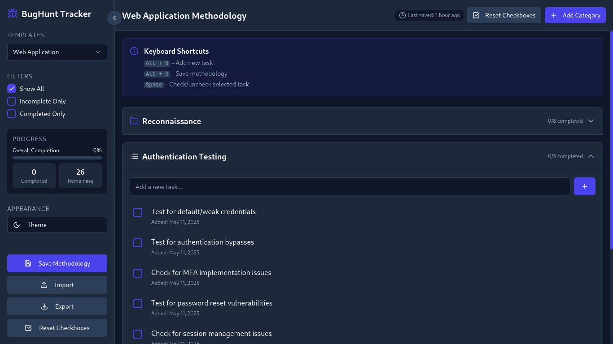
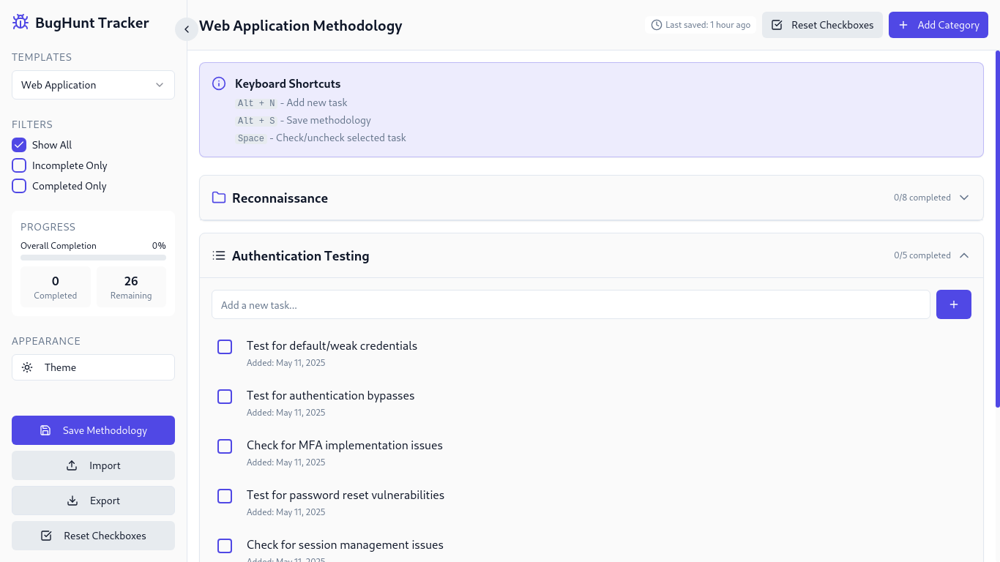

# Bug Bounty Methodology To-Do List Web Application

[](https://opensource.org/licenses/MIT) [](https://github.com/your-username/your-repo-name) [](https://github.com/your-username/your-repo-name/issues) **A concise and engaging one-liner describing your tool and its primary function.**

## Table of Contents

* [About](#about)
* [Features](#features)
* [Getting Started](#getting-started)
    * [Prerequisites](#prerequisites)
    * [Installation](#installation)

## About

A more detailed explanation of your tool. Expand on the one-liner and explain the problem it solves and its overall purpose. Who is this tool for and what benefits does it offer them?

## Features

A list highlighting the key features and functionalities of tool.
  <h1 align="center">Themes</h1> 
  
  
   
  <h4 align= "center">Choose Between Dark And Light Theme</h4>
   
  

  <h4 align="left">( Users Can Select Multiple Of Methodology Templates And Creater Her Own, Users Also Import And Export  Methodology To-Do List as JSON )</h4>
  <h1></h1>

  <p></p>
  <p></p>
  
  # Getting Started

This section guides users on how to get your tool up and running on their system.

### Prerequisites

List any software or dependencies that users need to have installed before they can use your tool. Include links to download them if necessary.

* [Node.js](https://nodejs.org/) (version >= 16.0.0, for example)
* [Git](https://git-scm.com/)
* [Python](https://www.python.org/) (version >= 3.8, if applicable)
* ...

### Installation

Provide clear and step-by-step instructions on how to install your tool. This might involve cloning a repository, installing packages, or running an installation script.

1.  **Clone the repository:**
    ```bash
    git clone [https://github.com/your-username/your-repo-name.git](https://github.com/your-username/your-repo-name.git)
    cd your-repo-name
    ```

2.  **Install dependencies:**
    ```bash
    npm install
    # And
    npm run build
    ```

3.  **Run.**
    ```bash
    npm start
    ```
    # Now Your To-Do Web App Succesfully Running Localy On (http://localhost:5000)
